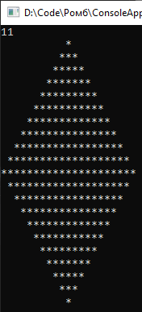

# CreateRhombus
Предваряя запуск программы, нужно учесть, что запускается она в консольке. 

От сих, в свойствах консольки, в подвкладке "шрифт", выставим размер шрифта равным шести, семи или восьми, и нажмём "ок".

А вот, что по программульке: 
1. можно задать число в границах от 0 до 2147483647 Да, защиту от дурака для такого проекта не настраивал;
2. на выходе - ромб, срединная линия которого приходится на введенное нами число.

Подытог: вот такенный майндфак на выходе 
>
